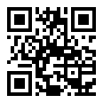

# Overview

The Syncfusion Essential JS Barcode widget enables rendering of one dimension and two dimension barcodes in web page. Barcode provides you a simple and inexpensive method of encoding text information that can be easily read by electronic readers.

**Key Features**

* Supports 10 one-dimensional barcodes including Code 39 and Code 32 barcodes.
* Supports 2 two-dimensional barcodes such as QR and Data Matrix barcodes.

# Getting Started

Before we start with the Barcode, please refer [this page](https://help.syncfusion.com/aurelia/overview#getting-started) page for general information regarding integrating Syncfusion widget's.

For quick start, we already configured a template project in GitHub repository [syncfusion-template-repository](https://github.com/aurelia-ui-toolkits/syncfusion-template-repository). Run the below set of commands to clone the repository and install the required packages for Syncfusion Aurelia application.



    > git clone "https://github.com/aurelia-ui-toolkits/syncfusion-template-repository"
    > cd syncfusion-template-repository
    > npm install
    > jspm install



The below steps describes to create Syncfusion Aurelia Barcode component.

    Create barcode folder inside src/samples/ location.
    Create barcode.html file inside src/samples/barcode folder and use the below code example to render the Barcode component.
    Properties can be defined with `e-` prefix and long text properties needs to separated by `-`. E.g. ( `e-text` , `e-symbology-type`).
	


    <template>
    

        <ej-barcode id="barcode" e-text="https://www.syncfusion.com/" e-symbology-type="qrbarcode"></ej-barcode>
    

    </template>

	

* Create `barcode.js` file inside `src/samples/barcode` folder with below code snippet.



export class BasicUse {
}



The above code will create a Barcode as shown below.

