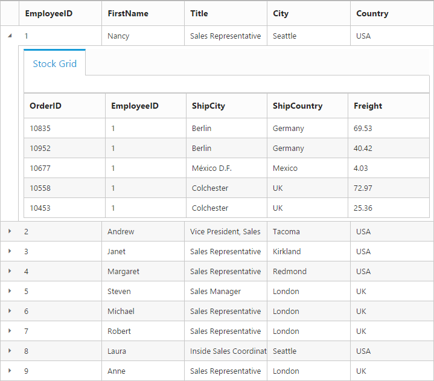

---
layout: post
title: Row with Grid widget for Syncfusion Essential Aurelia
description: How to use and customize the grid row
platform: Aurelia
control: Grid
documentation: ug
--- 
# Row

It represents the record details that are fetched from the datasource.

## Details Template

It provides a detailed view /additional information about each row of the grid. You can render any type of JsRender template and assign the script template id in the [`e-details-template`](http://help.syncfusion.com/api/js/ejgrid#members:detailstemplate "detailsTemplate") property. And also you can change HTML elements in detail template row into JavaScript controls using [`e-on-details-data-bound`](http://help.syncfusion.com/api/js/ejgrid#events:detailsdatabound "detailsDataBound") event.

On enabling details template, new column will be added in grid with an expander button in it and that can be expanded or collapsed to show or hide the underlying details row respectively.

N> It's a standard way to enclose the template within the `script` tag with `type` as "text/template".

The following code example describes the above behavior.


<ej-grid e-data-source.bind="data" e-columns.bind="cols" e-details-template.bind="detailTemp" e-on-details-data-bound.trigger="detailgrid($event)">
  </ej-grid>

   



 export class Grid {
    
            constructor() {
			    this.data = window.employeeView;
                this.cols = [				
                    { field: "EmployeeID" },
                    { field: "FirstName" },
                    { field: "Title" },
                    { field: "City" },
                    { field: "Country" }
                ];
                this.detailTemp= "#tabGridContents";
			}
            detailgrid(e){
                var filteredData = e.detail.data["EmployeeID"];
                var data = ej.DataManager(window.ordersView).executeLocal(ej.Query().where("EmployeeID", "equal", parseInt(filteredData), true).take(5));
                e.detail.detailsElement.find("#detailGrid").ejGrid({
                    dataSource: data,
                    columns: ["OrderID", "EmployeeID", "ShipCity", "ShipCountry", "Freight"]
                });
                e.detail.detailsElement.find(".tabcontrol").ejTab();
            }
    }



The following output is displayed as a result of the above code example.

