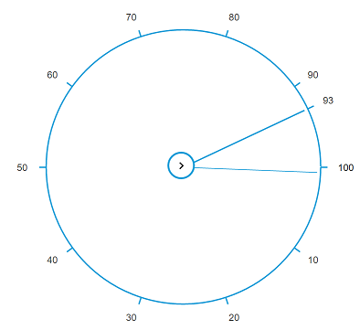

# Getting Started

This section helps to get started of the RadialSlider component in an Aurelia application.

## Create a RadialSlider Widget

*	To create Syncfusion Aurelia application refer [Aurelia Getting Started](https://help.syncfusion.com/aurelia/overview#getting-started) Documentation.
*	Create `radialslider` folder inside `src/samples` location.
* Create `radialslider.html` file inside `src/samples/radialslider` folder and use the below code for rendering RadialSlider component.



    <template>
    <ej-radial-slider id="radialSlider"> </ej-radial-slider>
    </template>


 

* Create `radialslider.js` file inside `src/samples/radialslider` folder with below code snippet.



    export class BasicUse {
    constructor() {    
    }
    }



## Image Configuration

RadialSlider property **e-inner-circle-image-url** allow to set URL image to the inner circle of the RadialSlider. Refer to the following code example.



    <ej-radial-slider id="radialSlider" e-inner-circle-image-url="images/radialslider/chevron-right.png">
    </ej-radial-slider>



> _Note:_ _You can find the RadialSlider properties from the_ [API reference](https://help.syncfusion.com/api/js/ejradialslider) _document_

