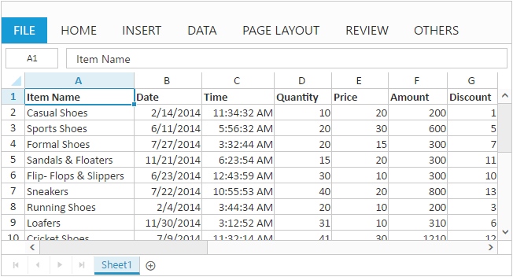

# Getting started

This section explains you the steps required to populate the Spreadsheet with data, format, and export it as excel file. This section covers only the minimal features that you need to know to get started with the Spreadsheet.

## Initialize Spreadsheet

* To create Syncfusion Aurelia application refer [Aurelia Getting Started documentation](https://help.syncfusion.com/aurelia/overview#getting-started "").
* Create `spreadsheet` folder inside `src/samples` location.
* Create `spreadsheet.html` file inside  `src/samples/spreadsheet` folder and use the below code for rendering Spreadsheet component 



<template>	
	

			<ej-spreadsheet id="Spreadsheet"></ej-spreadsheet>
	

</template>



* Create `spreadsheet.js` file inside `src/samples/spreadsheet` folder with below code snippet.



export class Spreadsheet {
  
        constructor() {}

}



* Now, we are going to configure the navigation for created Spreadsheet sample in `src/app.js` file



export class App {
  configureRouter(config, router) {
    config.title = 'Aurelia Syncfusion';
    config.map([
      { route: ['', 'welcome'], name: 'welcome',      moduleId: 'welcome',                              nav: true, title: 'Welcome' },
      { route: 'child-router',  name: 'child-router', moduleId: 'child-router',                         nav: true, title: 'Child Router' },
      { route: 'button',        name: 'button',       moduleId: 'samples/button/button',                nav: true, title: 'Button' },
	  { route: 'spreadsheet',   name: 'spreadsheet',  moduleId: 'samples/spreadsheet/spreadsheet',      nav: true, title: 'Spreadsheet' }
	  
    ]);

    this.router = router;
}
}



Now, the Spreadsheet is rendered with default row and column count.

## Populate Spreadsheet with data

Now, this section explains how to populate JSON data to the Spreadsheet. You can set`dataSource` attribute in `ej-sheet` tag to populate JSON data in Spreadsheet.



<template>
	

			<ej-spreadsheet id="Spreadsheet">
			    <ej-sheet e-range-settings.bind = "range"></ej-sheet>
			</ej-spreadsheet>
	

</template>





import '../scripts/xljsondata.js';
export class Spreadsheet {
  constructor() {
    this.range = [{ dataSource: window.defaultData }];
  }
}



## Apply Conditional Formatting

Conditional formatting helps you to apply formats to a cell or range with certain colour based on the cells values. You can use `e-allow-conditional-formats` attribute to enable/disable Conditional formats.

To apply conditional formats for a range use `e-c-format-rule` attribute. The following code example illustrates this,



<template>	
	

			<ej-spreadsheet id="Spreadsheet">
			    <ej-sheet e-range-settings.bind = "range" e-c-format-rule.bind="format"></ej-sheet>
		    </ej-spreadsheet>
	

</template>





import '../scripts/xljsondata.js';
export class DefaultFunctionalities {
    constructor() {
        this.range = [{ dataSource: window.defaultData }];
        this.format = [{ action: ej.Spreadsheet.CFormatRule.GreaterThan, inputs: ["10"], color: ej.Spreadsheet.CFormatHighlightColor.RedFill, range: "D2:D8" }];
        }
}



## Export Spreadsheet as Excel File

The Spreadsheet can save its data, style, format into an excel file. To enable save option in Spreadsheet set `e-allow-exporting` option in `e-export-settings` as `true`. Since Spreadsheet uses server side helper to save documents set `excelUrl` in `e-export-settings` option. The following code example illustrates this,



<template>
	

			<ej-spreadsheet id="Spreadsheet" e-export-settings.bind = "export"></ej-spreadsheet>
	

</template>





import '../scripts/xljsondata.js';
export class Spreadsheet {
  constructor() {
	  this.export = { excelUrl: 'http://js.syncfusion.com/demos/ejservices/api/JSXLExport/ExportToExcel'};
  }
}



Use shortcut `Ctrl + S` to save Spreadsheet as excel file
