# Columns in Aurelia TreeGrid

Column definitions specified in the [`e-columns`](https://help.syncfusion.com/api/js/ejtreegrid#members:columns "columns") option defines how the data in the **DataSource** have to be displayed, formatted and edited in TreeGrid. The values in the **DataSource** can be mapped to the appropriate column using the [`column.field`](https://help.syncfusion.com/api/js/ejtreegrid#members:columns-field "Field") property of the corresponding column object.

## Editing type

The edit type of a column can be defined using the [`editType`](https://help.syncfusion.com/api/js/ejtreegrid#members:columns-edittype "editType") property of the column object.

The following example shows how to define the `editType` in a column,


<template>
    

        <ej-tree-grid id="TreeGrid"
            e-columns.bind="columns"
			//...
            >
        </ej-tree-grid>
    

</template>




export class DefaultSample {
    constructor() {
    	this.columns = [
      		{ field: 'taskID', headerText: 'Id', width: 70, editType: ej.TreeGrid.EditingType.Numeric },
      		{ field: 'taskName', headerText: 'Task Name', editType: ej.TreeGrid.EditingType.String },
      		{ field: 'startDate', headerText: 'Start Date', editType: ej.TreeGrid.EditingType.DatePicker },
      		{ field: 'duration', headerText: 'Duration', editType: ej.TreeGrid.EditingType.Numeric }
    	];
    }
}



The column editors can be further customized by using the [`editParams`](https://help.syncfusion.com/api/js/ejtreegrid#members:columns-editparams "editParams") property of column object. 

The following example shows how to define additional properties to the date picker control,



export class DefaultSample {
    constructor() {
		this.columns = [
			//..
      		{ field: 'startDate', headerText: 'Start Date', editType: ej.TreeGrid.EditingType.DatePicker, 
        	  editParams: { highlightWeekend: true} },
    	];
    }
}



## Formatting

The values in each column can be formatted using the [`format`](https://help.syncfusion.com/api/js/ejtreegrid#members:columns-format "format") property of the column object.

The following code example shows how to format the numeric and date values in TreeGrid column,



export class DefaultSample {
    constructor() {
    	this.columns = [
      		{ field: 'percentage', headerText: 'Percentage', format: '{0:P0}' },
      		{ field: 'currency', headerText: 'currency', format: '{0:C2}'},
      		{ field: 'startDate', headerText: 'Start Date', format: '{0:MM/dd/yyyy}' },
			{ field: 'endDate', headerText: 'End Date', format: '{0:MM/dd/yyyy hh:mm:ss}' },
    	];
    }
}


N> 1.For more numeric format strings, please refer this [link](https://msdn.microsoft.com/library/dwhawy9k(v=vs.100).aspx).
N> 2.For more date format strings, please refer this [link](https://msdn.microsoft.com/library/az4se3k1(v=vs.100).aspx).

## Defining column width

In TreeGrid, it is possible to define width for a specific column by setting [`width`](https://help.syncfusion.com/api/js/ejtreegrid#members:columns-width "width") property to the column object.

The below code snippet shows how to set width for specific column,



export class DefaultSample {
    constructor() {
    	this.columns = [
      		{ field: 'taskID', headerText: 'Id', width: 70, editType: ej.TreeGrid.EditingType.Numeric },
      		{ field: 'taskName', headerText: 'Task Name', editType: ej.TreeGrid.EditingType.String, width: 250 },
      		{ field: 'startDate', headerText: 'Start Date', editType: ej.TreeGrid.EditingType.DatePicker, width: 80},
      		{ field: 'duration', headerText: 'Duration', editType: ej.TreeGrid.EditingType.Numeric, width: 80 }
    	];
    }
}


The below screenshot shows the TreeGrid rendered with specific column width values.

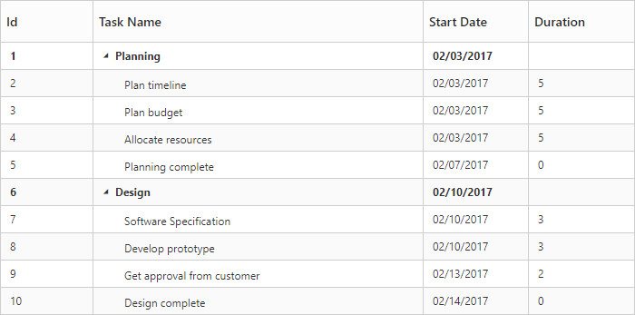

### Defining common width for the columns

The TreeGrid control provides the support to set same width for all the available columns and this can be done by using [`commonWidth`](https://help.syncfusion.com/api/js/ejtreegrid#members:commonwidth "commonWidth") property.
The below code snippets shows how to define common width for all columns.


<template>
    

        <ej-tree-grid id="TreeGrid"
            e-columns.bind="columns"

			//...
            >
        </ej-tree-grid>
    

</template>




export class DefaultSample {
    constructor() {
    	this.columns = [
      		{ field: 'taskID', headerText: 'Id', editType: ej.TreeGrid.EditingType.Numeric },
      		{ field: 'taskName', headerText: 'Task Name', editType: ej.TreeGrid.EditingType.String },
      		{ field: 'startDate', headerText: 'Start Date', editType: ej.TreeGrid.EditingType.DatePicker },
      		{ field: 'duration', headerText: 'Duration', editType: ej.TreeGrid.EditingType.Numeric }
    	];
    }
}



The below screenshot shows TreeGrid render with common width. 
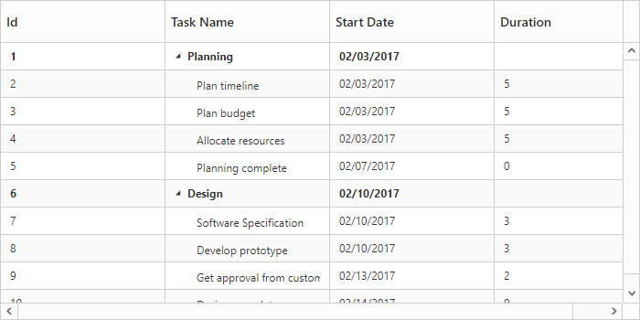

## Headers

### Header text

Using the [`headerText`](https://help.syncfusion.com/api/js/ejtreegrid#members:columns-headertext "headertext") property, you can provide the title for a specific column. The below code snippet shows how to set `headerText` for TreeGrid columns.



export class DefaultSample {
    constructor() {
    	this.columns = [
      		{ field: 'taskID', headerText: 'Id'},
      		{ field: 'taskName', headerText: 'Task Name'},
      		{ field: 'startDate', headerText: 'Start Date'},
      		{ field: 'duration', headerText: 'Duration' }
    	];
    }
}



### Text wrapping

It is possible to wrap the header text or the title of the column when the content exceeds the column width using [`headerTextOverflow`](https://help.syncfusion.com/api/js/ejtreegrid#members:headertextoverflow "headerTextOverflow ") property. By default this property is set to **none**. 
To enable wrapping of header text, you have to set the `headerTextOverflow` property as **wrap**. 
The below code snippet demonstrates this.



<template>
    

        <ej-tree-grid id="TreeGrid"
			//..
            e-header-text-overflow="wrap"
            >
        </ej-tree-grid>
    

</template>





export class DefaultSample {
    constructor() {
    	this.columns = [
      		{ field: 'taskID', headerText: 'Id'},
      		{ field: 'taskName', headerText: 'Detailed name of assigned tasks'},
      		{ field: 'startDate', headerText: 'Start Date'},
      		{ field: 'duration', headerText: 'Duration' }
    	];
    }
}



The below screenshot depicts the output of above code example.

### Header Template

TreeGrid column's header template was defined by using [`headerTemplateID`](https://help.syncfusion.com/api/js/ejtreegrid#members:columns-headertemplateid) property. The value of this property should be a valid JsRender template.

The following code snippet shows how to set the header template for TreeGrid columns,


	<template>
         
        
        
    	

        	<ej-tree-grid id="TreeGrid"
            	e-columns.bind="columns"
				//...
                >
        	</ej-tree-grid>
    	

</template>





export class DefaultSample {
    constructor() {
    	this.columns = [
			//...
      		{ field: 'taskName', editType: ej.TreeGrid.EditingType.String, headerTemplateID: '#nameHeader'},
      		{ field: 'startDate', editType: ej.TreeGrid.EditingType.DatePicker, headerTemplateID: '#dateTemplate'},
    	];
    }
}



The below screenshot depicts column headers with custom templates.
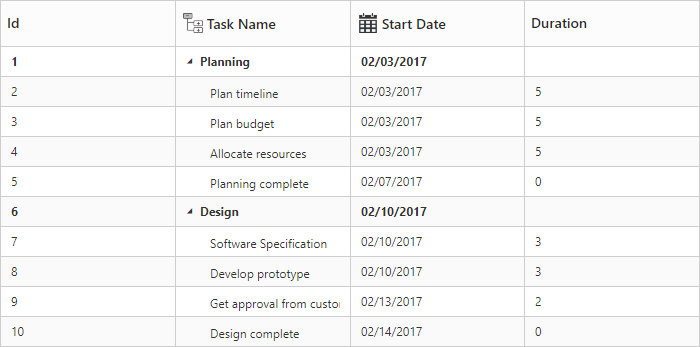

## Frozen Columns

Specific columns can be frozen by enabling the [`isFrozen`](https://help.syncfusion.com/api/js/ejtreegrid#members:columns-isfrozen "isFrozen") property of the respective column object. The columns which are frozen remain static while scrolling the content horizontally. You can also freeze or unfreeze a column during runtime, by selecting Freeze or Unfreeze menu item in the column menu. These set of menu options will be displayed in all the columns when the `isFrozen` property is enabled in any of the columns. However you can control the visibility of these menu options in a particular column by enabling/disabling the [`allowFreezing`](https://help.syncfusion.com/api/js/ejtreegrid#members:columns-allowfreezing "allowFreezing") property of that specific column.



export class DefaultSample {
    constructor() {
    	this.columns = [
      		{ field: 'taskID', headerText: 'Id', editType: ej.TreeGrid.EditingType.Numeric, isFrozen: true, allowFreezing: false},
      		{ field: 'taskName', headerText: 'Task Name', editType: ej.TreeGrid.EditingType.String, width: 200},
      		{ field: 'startDate', headerText: 'Start Date', editType: ej.TreeGrid.EditingType.DatePicker, isFrozen: true},
			//..
    	];
    }
}



The below screenshot depicts TreeGrid with frozen columns,

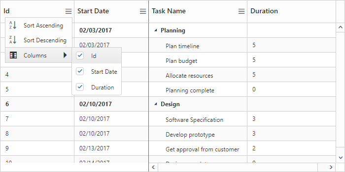

It is also possible to freeze all the preceding columns at run-time by choosing **Freeze Preceding Columns** option in the column menu or by using the [`freezePrecedingColumns`](https://help.syncfusion.com/api/js/ejtreegrid#methods:freezeprecedingcolumns "freezePrecedingColumns") method, the column field name, for which the columns preceding it to be frozen should be passed as the method parameter.

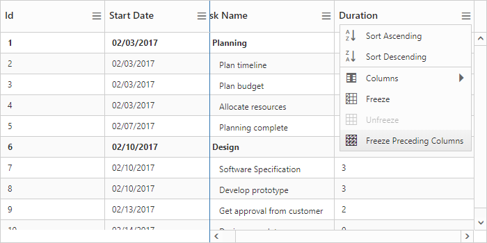

### Freeze columns using method

Columns can also be frozen or unfrozen on any custom actions using the [`freezeColumn`](/api/js/ejtreegrid#methods:freezecolumn "freezeColumn") method.
The column's field name which is to be frozen/unfrozen should be passed as the method parameter, along with the freeze state.



<template>
    

        <ej-tree-grid 
            e-widget.bind="TreeGrid">
        </ej-tree-grid>
    

    <button type="button" click.delegate="freezeColumn()">Freeze Column</button>
</template>





export class DefaultSample {
	constructor() {
		//..
  	}
	freezeColumn() {
    	this.TreeGrid.freezeColumn('taskName', true);
  	}
}



[Click](https://aureliajq.syncfusion.com/#/samples/treegrid/Frozen-Column) here to view the online demo sample for frozen column.

## Resizing

You can resize the column width to view the hidden text of the cell. This feature can be enabled by setting the [`e-allow-column-resize`](https://help.syncfusion.com/api/js/ejtreegrid#members:allowcolumnresize "allowColumnResize") property to `true`.



<template>
    

        <ej-tree-grid 
            e-allow-column-resize="true">
        </ej-tree-grid>
    

    <button type="button" click.delegate="freezeColumn()">Freeze Column</button>
</template>



### Column resize mode

In TreeGrid, it is possible to provide different column resizing mode by using [`columnResizeMode`](https://help.syncfusion.com/api/js/ejtreegrid#members:columnresizesettings-columnresizemode "columnResizeMode") property of [`columnResizeSettings`](https://help.syncfusion.com/api/js/ejtreegrid#members:columnresizesettings "columnResizeSettings") property.

The below are the types of column resize modes available in TreeGrid,

* Normal - Columns are stretched with control width at load time. When resizing the column, the current column width is updated based on next column.
* Next column - Columns are stretched with control width at load time. When resize the column the current column width is updated based on stretching columns in control width.
* Fixed Columns - Column are rendered with given width value at load time. Only the current column width is changed while resizing the column.

The following code snippet explains how to set column resize mode in TreeGrid.


<template>
    

        <ej-tree-grid 
            e-allow-column-resize="true"
            e-column-resize-settings.bind="columnResizeSettings">
        </ej-tree-grid>
    

</template>




export class DefaultSample {
	constructor() {
    	this.columnResizeSettings = {
      		columnResizeMode: ej.TreeGrid.ColumnResizeMode.FixedColumns
    	};
  	}
}


The below screenshot shows the TreeGrid rendered with `FixedColumns` resize mode.

## Checkbox column
It is possible to display a column value as checkbox in TreeGrid by enabling the [`displayAsCheckbox`](https://help.syncfusion.com/api/js/ejtreegrid#members:columns-displayascheckbox "displayAsCheckbox") property and by setting the [`editType`](https://help.syncfusion.com/api/js/ejtreegrid#members:columns-edittype) property as `boolean` for that column. If the `displayAsCheckbox` property was set as `false`, then the column value will be displayed as string with the value mapped from the data source. The following code snippet explains how to display boolean value as checkbox column in TreeGrid.



export class DefaultSample {
	constructor() {
    	this.columns = [
      		{ field: 'approved', headerText: 'Approved', editType: ej.TreeGrid.EditingType.Boolean, displayAsCheckbox: true }
    	];
  	}
}



The below screen shot depicts the `Approved` column in TreeGrid displayed as a checkbox column.

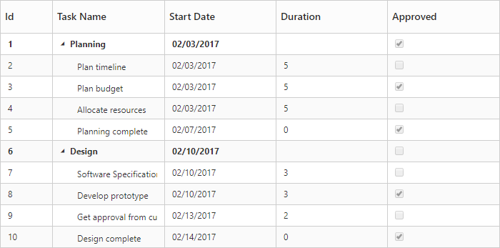

## Column Template

Column Template is used to customize the column’s look and feel based on requirement.

The following code example shows you how to display the icon in the TreeGrid column,

* [`templateID`](https://help.syncfusion.com/api/js/ejtreegrid#members:columns-templateid) - Using the [`templateID`](https://help.syncfusion.com/api/js/ejtreegrid#members:columns-templateid) property, you can specify the Id of the script element, which contains the template for the column.
* [`template`](https://help.syncfusion.com/api/js/ejtreegrid#members:columns-template) - HTML templates can be specified in the [`template`](https://help.syncfusion.com/api/js/ejtreegrid#members:columns-template) property of the particular column as a string (HTML element).

Column template support was enabled for that column by setting [`isTemplateColumn`](https://help.syncfusion.com/api/js/ejtreegrid#members:columns-istemplatecolumn) as `true`.

The following code example show how to define template for the column.



<template>
    

        <ej-tree-grid 
            e-widget.bind="TreeGrid"
            id="TreeGrid"
            e-data-source.bind="ProjectData"
            e-child-mapping="subtasks"
            e-row-height="50">
            <ej-tree-grid-column e-field="resource" e-header-text="Resource" e-width="110" e-is-template-column="true">
                <ej-template>
                    

                        

                    

                </ej-template>
            </ej-tree-grid-column>
            <ej-tree-grid-column e-field="taskID" e-header-text="Id" ></ej-tree-grid-column>
            <ej-tree-grid-column e-field="taskName" e-header-text="Task Name"></ej-tree-grid-column>
            <ej-tree-grid-column e-field="startDate" e-header-text="Start Date"></ej-tree-grid-column>
            <ej-tree-grid-column e-field="duration" e-header-text="Duration"></ej-tree-grid-column>
        </ej-tree-grid>
    

</template>



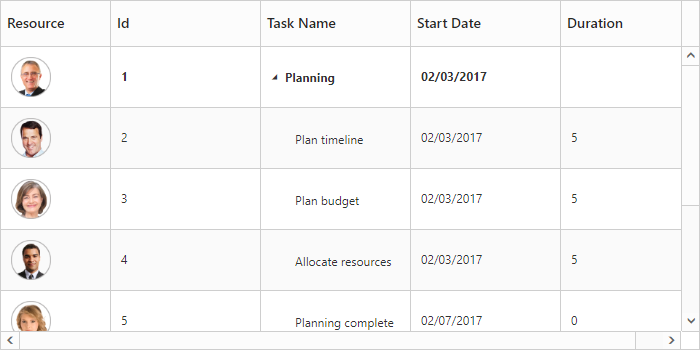

## Column Menu

Column menu can be displayed in column header by setting [`showColumnChooser`](https://help.syncfusion.com/api/js/ejtreegrid#members:showcolumnchooser) property as `true`.

The following are the items displayed in the column menu,

* **Column Chooser** – Displays all the column names, you can enable or disable a column by check or uncheck the respective column name in the column chooser menu.
* **Sort Ascending & Sort Descending** – Used to sort the items in the column. These menu options will be displayed only when you set the [`allowSorting`](https://help.syncfusion.com/api/js/ejtreegrid#members:allowsorting) property as true. To perform multilevel sorting, the [`allowMultiSorting`](https://help.syncfusion.com/api/js/ejtreegrid#members:allowmultisorting) property should be enabled.
* **Freeze, Unfreeze & Freeze Preceding Columns** – Used to freeze or unfreeze the columns. These set of menu options will be displayed in all the columns when the [`isFrozen`](https://help.syncfusion.com/api/js/ejtreegrid#members:columns-isfrozen) property is enabled in any of the columns. However, you can control the visibility of these menu options in a particular column by enabling/disabling the [`allowFreezing`](https://help.syncfusion.com/api/js/ejtreegrid#members:columns-isfrozen) property of that specific column.



<template>
    

        <ej-tree-grid 
            e-widget.bind="TreeGrid"
            id="TreeGrid"
            e-columns.bind="columns"
            e-allow-sorting="true"
            e-allow-multi-sorting="true" 
			e-show-column-chooser="true"
			e-show-column-options="true"
            >
        </ej-tree-grid>
    

</template>





export class DefaultSample {
	constructor() {
    	this.columns = [
      		//...
      		{ field: 'startDate', headerText: 'Start Date', editType: ej.TreeGrid.EditingType.DatePicker, visible: false},
    	];
  	}
}



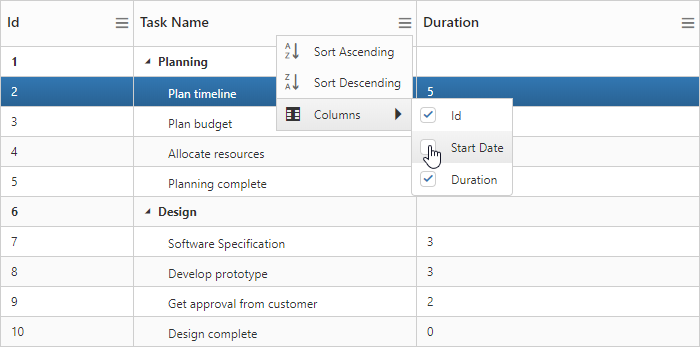

The column menu also provides support for some of the additional column options such as,

* Insert column left
* Insert column right 
* Delete column
* Rename column

The column options can be enabled or disabled with the [`showColumnOptions`](https://help.syncfusion.com/api/js/ejtreegrid#members:showcolumnoptions) property, default value of this property is `false`.

The following code example shows how to enable the column option in TreeGrid,





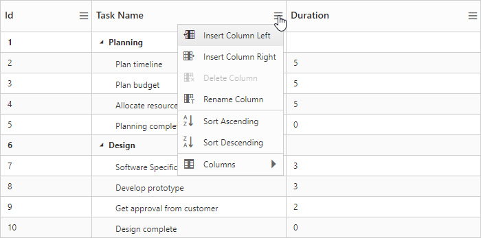
Column menu option in TreeGrid
{:.caption}

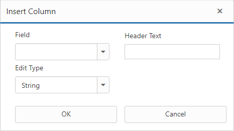
Column insert dialog in TreeGrid  
{:.caption}

The TreeGrid columns can also be renamed or deleted at run-time on any custom actions using the [`renameColumn`](https://help.syncfusion.com/api/js/ejtreegrid#methods:renamecolumn "renameColumn") and [`deleteColumn`](https://help.syncfusion.com/api/js/ejtreegrid#methods:deletecolumn "deleteColumn") methods.

### Customize insert column dialog fields

It is possible to add or remove the [`columns`](https://help.syncfusion.com/api/js/ejtreegrid#members:columns) properties in insert column dialog using [`columnDialogFields`](https://help.syncfusion.com/api/js/ejtreegrid#members:columndialogfields) property. In insert column dialog `field`, `headerText` and `editType` properties are necessary to create a new column, so these fields are unable to remove from insert column option.

The following code example shows how to customize the insert column option in TreeGrid,



<template>
    

        <ej-tree-grid 
            e-widget.bind="TreeGrid"
            id="TreeGrid"
            e-columns.bind="columns"
            e-allow-sorting="true"
            e-allow-multi-sorting="true" 
			e-show-column-chooser="true"
			e-show-column-options="true"
			e-column-dialog-fields.bind="columnEditDialogFields"
            >
        </ej-tree-grid>
    

</template>





export class DefaultSample {
	constructor() {
    	this.columnEditDialogFields = ['width', 'textAlign', 'headerTextAlign', 'allowSorting', 'visible'];
  	}
}


The below screenshot shows customized insert column dialog in TreeGrid.  

### Hide specific column in column chooser list
It is possible to hide the specific column in column chooser list by settings [`showInColumnChooser`](https://help.syncfusion.com/api/js/ejtreegrid#members:columns-showincolumnchooser) as `false` in the column definition.

The following code example shows how to hide specific column in column chooser list,



export class DefaultSample {
	constructor() {
		this.columns = [
      		{ field: 'taskID', headerText: 'Id', editType: ej.TreeGrid.EditingType.Numeric, width: 70, showInColumnChooser: false},
			//...
    	];
  	}
}



The below screenshot shows TreeGrid column chooser without `Id` column. 
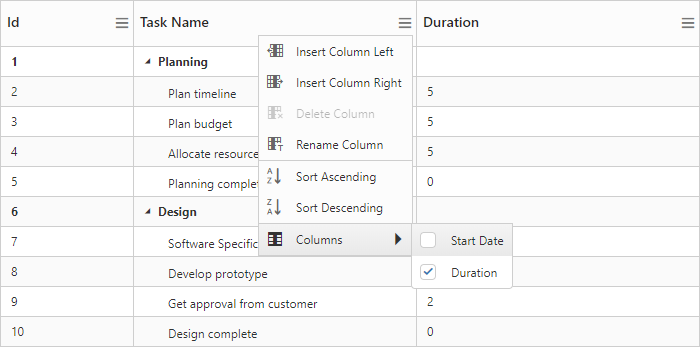

## Show/Hide columns using method
It is possible to toggle the visibility of the columns using the [`hideColumn`](/api/js/ejtreegrid#methods:hidecolumn "hideColumn") and [`showColumn`](/api/js/ejtreegrid#methods:showcolumn "showColumn") methods. The column's header text should be passed as the method parameter which is to be shown/hidden.


<template>
    

        <ej-tree-grid 
            e-widget.bind="TreeGrid"
            id="TreeGrid"
			//...
            >
        </ej-tree-grid>
    

    <button type="button" click.delegate="showColumn()">Show Column</button>
    <button type="button" click.delegate="hideColumn()">Hide Column</button>
</template>




export class DefaultSample {
	constructor() {
		//...
  	}
  	showColumn() {
		this.TreeGrid.showColumn('Start Date');
  	}
  	hideColumn() {
    	this.TreeGrid.hideColumn('Start Date');
  	}
}


## Command Column

### Default action buttons

Using command columns in TreeGrid, we can display a separate column to perform CRUD operations. It is also possible to perform any custom actions by using custom command buttons. Command column can be defined in TreeGrid by using the [`commands`](https://help.syncfusion.com/api/js/ejtreegrid#members:columns-commands) property.
A command column can be customized by using the [`type`](https://help.syncfusion.com/api/js/ejtreegrid#members:columns-commands-type) and [`buttonOptions`](https://help.syncfusion.com/api/js/ejtreegrid#members:columns-commands-buttonoptions) properties.

* **type**: Using this property we can add required action buttons in TreeGrid command column such as edit,delete,save and cancel.
* **buttonOptions**: Using this property we can customize the button in the command column with the properties available in [ejButton](https://help.syncfusion.com/api/js/ejbutton#members "Button").



export class DefaultSample {
	constructor() {
		this.columns = [
			//...
      		{
        		headerText: 'Manage Records',
        		commands: [
            		{ type: ej.TreeGrid.UnboundType.Edit, buttonOptions: { text: 'Edit', width: 50 } },
            		{ type: ej.TreeGrid.UnboundType.Delete, buttonOptions: { text: 'Delete', width: 50 } },
            		{ type: ej.TreeGrid.UnboundType.Save, buttonOptions: { text: 'Save', width: 50 } },
            		{ type: ej.TreeGrid.UnboundType.Cancel, buttonOptions: { text: 'Cancel', width: 50 } }
        		]	
      		}
    	];
  	}
}

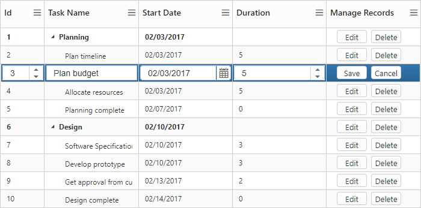

### Custom buttons

We can also add custom buttons to the command column by specifying text value other than default buttons to the type property. We can also bind actions to the custom button using the [Click](https://help.syncfusion.com/api/js/ejbutton#events:click "click") client-side event of button.


export class DefaultSample {
	constructor() {
		this.columns = [
			//...
			{
        	headerText: 'Manage Records',
        	commands: [
          	{
            	type: 'Details',
            	buttonOptions: {
            		text: 'Details', width: 50, 
					click: function(args) {
                		let $tr = $(args.e.target).closest('tr');
                  		let treeObj = $('#TreeGrid').data('ejTreeGrid');
                  		let rowIndex = treeObj.getIndexByRow($tr);
                  		let record = treeObj.model.currentViewData[rowIndex];
                  		alert('Task Name: ' + record.item.taskName);
                	}
            	}
          	}]
    		}
    	];
  	}
}


## Tree column/ Expander column 

The position of the expander column/tree column can be changed by using the [`treeColumnIndex`](https://help.syncfusion.com/api/js/ejtreegrid#members:treecolumnindex) property.

The following code example shows how to change the position of the expander column,


 <template>
    

        <ej-tree-grid 
            e-widget.bind="TreeGrid"
            id="TreeGrid"
            e-tree-column-index="1"
            >
        </ej-tree-grid>
    

</template>



The `treeColumnIndex` can also be changed at run-time by using the [`columnIndex`](https://help.syncfusion.com/api/js/ejtreegrid#methods:columnindex "columnIndex") method.

## Visibility

The visibility of TreeGrid column can be customized by using [`visible`](https://help.syncfusion.com/api/js/ejtreegrid#members:columns-visible) property. TreeGrid columns column be hidden by setting `visible` property as `false`.

The following code example explains how to hide the fourth column,


 
 export class DefaultSample {
	constructor() {
		this.columns = [
			//...
			{ field: 'startDate', headerText: 'Start Date', editType: ej.TreeGrid.EditingType.DatePicker, visible: false},
    	];
  	}
}
       


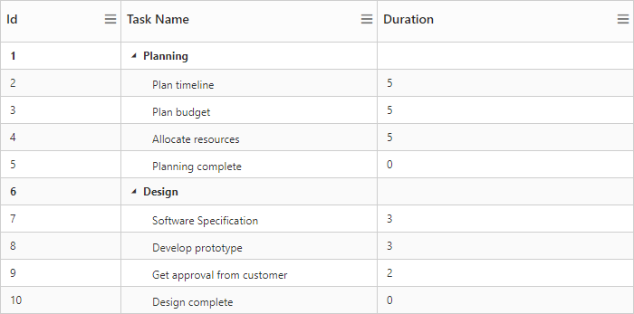

## Read-only

A column can be made read-only by setting the [`allowEditing`](https://help.syncfusion.com/api/js/ejtreegrid#members:columns-allowediting) property as `false`.

N> By setting [`columns.AllowEditing`](https://help.syncfusion.com/api/js/ejtreegrid#members:columns-allowediting) as `false` that specific column alone is made as read-only, and by setting the [`editSettings.allowEditing`](https://help.syncfusion.com/api/js/ejtreegrid#members:editsettings-allowediting) as `false` the entire TreeGrid is made read-only.

The below code snippet demonstrates this,


export class DefaultSample {
	constructor() {
		this.columns = [
			//...
			{ field: 'taskName', headerText: 'Task Name', allowEditing: false},
    	];
  	}
}



## Validation Rules

At some occasions, we will need to validate the data before updating it to the database. In TreeGrid it is possible to validate the data while performing adding and editing actions. The validation rules must be provided in the column definition using [`validationRules`](https://help.syncfusion.com/api/js/ejtreegrid#members:columns-validationrules) property. TreeGrid has built-in support for the below validation rules.

* **maxlength** – Makes the value require a given maximum text length.
* **minlength** – Makes the value require a given minimum text length.
* **required** – Makes the value required. 
* **number** – Makes the value require a decimal number.
* **range** – Makes the value require a given value range.

The below code example explains defining the validation rules for the column.



import 'jquery-validation/dist/jquery.validate.min';
import 'jquery-validation-unobtrusive/dist/jquery.validate.unobtrusive.min';
export class DefaultSample {
	constructor() {
		this.columns = [
      		{ field: 'taskID', headerText: 'Id',  width: 70, validationRules: { required: true}},
			//...
  	}
}



Custom validation error messages can also be defined in the column object. The below code example explains defining the custom error message. 


 
import 'jquery-validation/dist/jquery.validate.min';
import 'jquery-validation-unobtrusive/dist/jquery.validate.unobtrusive.min';
export class DefaultSample {
	constructor() {
		this.columns = [
      		{ field: 'taskID', headerText: 'Id', width: 70, validationRules: { required: true, messages: { required: 'should not left blank' } } },
			//...
  	}
}



### Custom Validation rules
Apart by the in-built validation rules, any custom validation rules can also be defined for the column. The below code example explains defining custom validation rule for a column.



import 'jquery-validation/dist/jquery.validate.min';
import 'jquery-validation-unobtrusive/dist/jquery.validate.unobtrusive.min';
export class DefaultSample {
	constructor() {
		$.validator.addMethod('validateStartDate', function (value, element, params) {
      		var obj = $('#TreeGrid').ejTreeGrid('instance');
      		if (new Date(value) <= new Date(2018, 11, 30) && new Date(value) >= new Date(2017, 0, 1)) {
        		return true;
      		}
      		return false;
    	}, 'Start date must be in 2017 or 2018 years');

		this.columns = [
      		{ field: 'startDate', headerText: 'Start Date', editType: ej.TreeGrid.EditingType.DatePicker, validationRules: { validateStartDate: true, required: true }},
			//...
  	}
}



The below image displays the TreeGrid with validation rule applied for a date column.

## Column Reorder

Column reorder support was used to change the order of the column by mouse interactions. In TreeGrid, [`e-allow-column-reordering`](https://help.syncfusion.com/api/js/ejtreegrid#members:allowcolumnreordering) property was used to enable this support and the default value of this property was `false`.

The following code example explains how to enable column reorder in TreeGrid,


<template>
    

        <ej-tree-grid 
            e-widget.bind="TreeGrid"
            id="TreeGrid"
            e-allow-column-reordering="true"
            >
        </ej-tree-grid>
    

</template>



The below screenshot shows the column reorder in TreeGrid.

The TreeGrid columns can also be reordered by using the [`reorderColumn`](https://help.syncfusion.com/api/js/ejtreegrid#methods:reordercolumn "reorderColumn") method, where the column field name and the target index should be passed as the method parameters.

## Text Alignment

In TreeGrid, it is possible to align both content and header text of particular column by using the [`textAlign`](https://help.syncfusion.com/api/js/ejtreegrid#members:columns-textalign) and [`headerTextAlign`](https://help.syncfusion.com/api/js/ejtreegrid#members:columns-headertextalign) property of columns. There are four possible ways to align content and header text of column, they are

1. Left
2. Right
3. Center
4. Justify

N> The `textAlign` property will affect both content and header text of the TreeGrid, when `headerTextAlign` is not set in the column definition.

The following code example explains how to set text alignment for content and header text in TreeGrid,


export class DefaultSample {
	constructor() {
		this.columns = [
			//...
			{ field: 'duration', headerText: 'Duration', editType: ej.TreeGrid.EditingType.Numeric, headerTextAlign: ej.TextAlign.Right, textAlign: ej.TextAlign.Right }
  	}
}


The below screenshot shows TreeGrid rendered with text alignment and header text alignment.

### Customize the column at initial load
In TreeGrid, it is possible to customize the column at load time using [`load`](https://help.syncfusion.com/api/js/ejtreegrid#events:load) event.

The following code examples shows how to customize the column at load time,


<template>
    

        <ej-tree-grid 
            e-on-load.delegate="load($event.detail)"
            >
        </ej-tree-grid>
    

</template>



export class DefaultSample {
  constructor() {
	//...
  }
  load(args) {
    var columns = args.model.columns;
	  columns[0].isFrozen = true;
	  columns[0].textAlign = 'center';
	  columns[2].visible = false;
  }
}

The below screenshot shows TreeGrid rendered with customized column.
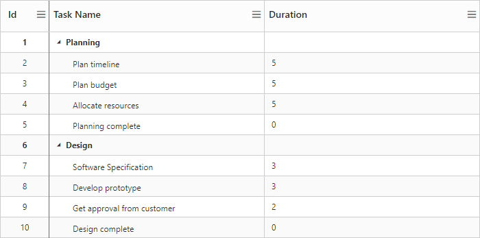

## Get Column Object

The column object which consists the list of columns available in TreeGrid and we can get the particular column details by using the [`getColumnByHeaderText`](https://help.syncfusion.com/api/js/ejtreegrid#methods:getcolumnbyheadertext "getColumnByHeaderText") and [`getColumnByField`](https://help.syncfusion.com/api/js/ejtreegrid#methods:getcolumnbyfield "getColumnByField") methods.

Similarly we can get the column index by using the [`getColumnIndexByField`](https://help.syncfusion.com/api/js/ejtreegrid#methods:getcolumnindexbyfield "getColumnIndexByField") method. To use this method we have to pass the field name as parameter. And we can get the field name of the column by using its `headerText` value by using [`getFieldNameByHeaderText`](https://help.syncfusion.com/api/js/ejtreegrid#methods:getfieldnamebyheadertext "getFieldNameByHeaderText") method.