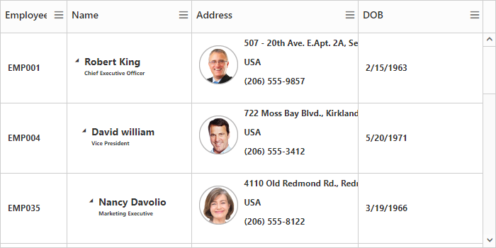
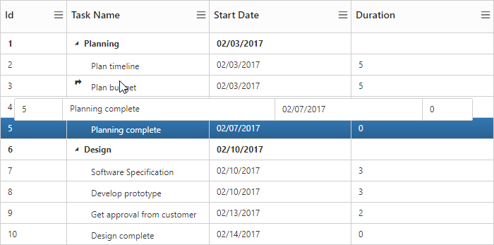
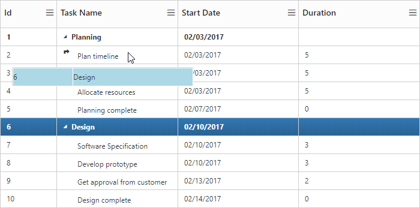
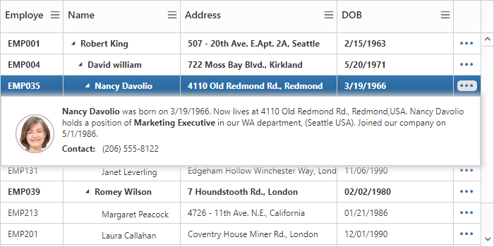
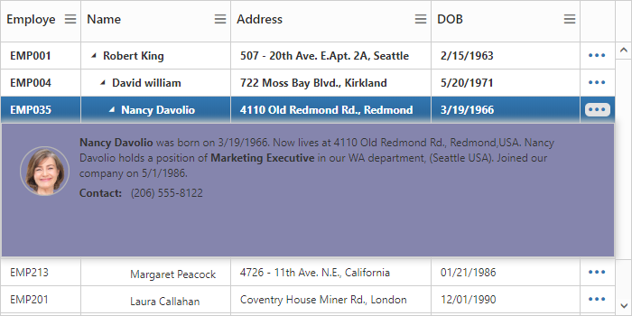
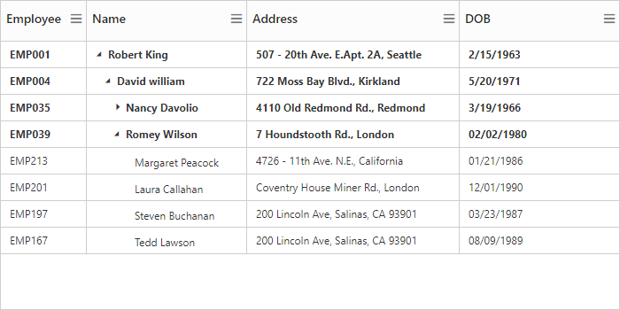
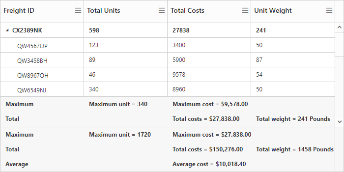

# Rows in Aurelia TreeGrid

The TreeGrid rows displays the information of each row from the bounded data source.

## Row Template

Row template is used to customize the TreeGrid rows based on requirements. In TreeGrid, [`e-row-template-id`](https://help.syncfusion.com/api/js/ejtreegrid#members:rowtemplateid) and [`e-alt-row-template-id`](https://help.syncfusion.com/api/js/ejtreegrid#members:altrowtemplateid) properties are used for customizing the row.

* **rowTemplateId** is used to customize all the rows in TreeGrid. For this property, ID of the row template is to be provided.

* **altRowTemplateId**  is used to customize the alternative rows in TreeGrid. For this property, ID of the alternative row template is to be provided.



<template>
    
    
    
    
    

        <ej-tree-grid 
            e-row-template-id="rowTemplateScript"
            e-alt-row-template-id="rowTemplateScript"
            >
        </ej-tree-grid>
    

</template>





export class DefaultSample {
  constructor() {
    this.columns = [
      { field: 'EmployeeID', headerText: 'EmployeeID', width: 80 },
      { field: 'Name', headerText: 'Name'},
      { field: 'Address', headerText: 'Address', width: 200},
      { field: 'DOB', headerText: 'DOB'}
    ];

    this.ProjectData = [{
      'Name': 'Robert King',
      'FullName': 'Robert King',
      'Designation': 'Chief Executive Officer',
      'EmployeeID': 'EMP001',
      'Address': '507 - 20th Ave. E.Apt. 2A, Seattle',
      'Contact': '(206) 555-9857',
      'Country': 'USA',
      'DOB': '2/15/1963',
      'DOJ': '5/1/1983',
      'Children': [{
        'Name': 'David William',
        'FullName': 'David William',
        'Designation': 'Vice President',
        'EmployeeID': 'EMP004',
        'Address': '722 Moss Bay Blvd., Kirkland',
        'Country': 'USA',
        'Contact': '(206) 555-3412',
        'DOB': '5/20/1971',
        'DOJ': '5/1/1991',

        'Children': [{
          'Name': 'Nancy Davolio',
          'FullName': 'Nancy Davolio',
          'Designation': 'Marketing Executive',
          'EmployeeID': 'EMP035',
          'Address': '4110 Old Redmond Rd., Redmond',
          'Country': 'USA',
          'Contact': '(206) 555-8122',
          'DOB': '3/19/1966',
          'DOJ': '5/1/1986',
          isExpanded: false,
          'Children': [
            {
              'Name': 'Andrew Fuller',
              'FullName': 'Andrew Fuller',
              'Designation': 'Sales Representative',
              'EmployeeID': 'EMP045',
              'Address': '14 Garrett Hill, London',
              'Country': 'UK',
              'Contact': '(71) 555-4848',
              'DOB': '9/20/1980',
              'DOJ': '5/1/2000',
            },
            {
              'Name': 'Anne Dodsworth',
              'FullName': 'Anne Dodsworth',
              'Designation': 'Sales Representative',
              'EmployeeID': 'EMP091',
              'Address': '4726 - 11th Ave. N.E., Seattle',
              'Country': 'USA',
              'Contact': '(206) 555-1189',
              'DOB': '10/19/1989',
              'DOJ': '5/1/2009',
            },
            {
              'Name': 'Michael Suyama',
              'FullName': 'Michael Suyama',
              'Designation': 'Sales Representative',
              'EmployeeID': 'EMP110',
              'Address': 'Coventry House Miner Rd., London',
              'Country': 'UK',
              'Contact': '(71) 555-3636',
              'DOB': '11/02/1987',
              'DOJ': '5/1/2007',
            },
            {
              'Name': 'Janet Leverling',
              'FullName': 'Janet Leverling',
              'Designation': 'Sales Coordinator',
              'EmployeeID': 'EMP131',
              'Address': 'Hollow Winchester Way, London',
              'Country': 'UK',
              'Contact': '(71) 555-3636',
              'DOB': '11/06/1990',
              'DOJ': '5/1/2010',
            },
          ]

        },
        {
          'Name': 'Romey Wilson',
          'FullName': 'Romey Wilson',
          'Designation': 'Sales Executive',
          'EmployeeID': 'EMP039',
          'Address': '7 Hounds tooth Rd., London',
          'Country': 'UK',
          'Contact': '(71) 555-3690',
          'DOB': '02/02/1980',
          'DOJ': '5/1/2000',
          isExpanded: true,
          'Children': [
            {
              'Name': 'Margaret Peacock',
              'FullName': 'Margaret Peacock',
              'Designation': 'Sales Representative',
              'EmployeeID': 'EMP213',
              'Address': '4726 - 11th Ave. N.E., California',
              'Country': 'USA',
              'Contact': '(206) 555-1989',
              'DOB': '01/21/1986',
              'DOJ': '5/1/2006',

            },
            {
              'Name': 'Laura Callahan',
              'FullName': 'Laura Callahan',
              'Designation': 'Sales Coordinator',
              'EmployeeID': 'EMP201',
              'Address': 'Coventry House Miner Rd., London',
              'Country': 'UK',
              'Contact': '(71) 555-2222',
              'DOB': '12/01/1990',
              'DOJ': '5/1/2010',
            },
            {
              'Name': 'Steven Buchanan',
              'FullName': 'Steven Buchanan',
              'Designation': 'Sales Representative',
              'EmployeeID': 'EMP197',
              'Address': '200 Lincoln Ave, Salinas, CA 93901',
              'Country': 'USA',
              'Contact': '(831) 758-7408',
              'DOB': '03/23/1987',
              'DOJ': '5/1/2007',
            },
            {
              'Name': 'Tedd Lawson',
              'FullName': 'Tedd Lawson',
              'Designation': 'Sales Representative',
              'EmployeeID': 'EMP167',
              'Address': '200 Lincoln Ave, Salinas, CA 93901',
              'Country': 'USA',
              'Contact': '(831) 758-7368 ',
              'DOB': '08/09/1989',
              'DOJ': '5/1/2009',
            },
          ]
        }]
      }]
    }];
  }
}



The output of TreeGrid with Row Template is as follows.

N> In TreeGrid, the given row template is parsed for default row functionality like row selection, alt row and other default row customization. Using [`parseRowTemplate`](https://help.syncfusion.com/api/js/ejtreegrid#members:parserowtemplate) property we can disable the row template parsing. If we disable that property, TreeGrid is rendered with given row template.

## Row Height

The [`e-row-height`](https://help.syncfusion.com/api/js/ejtreegrid#members:rowheight) property is used to change the height of row in TreeGrid, default value of this property is 30.
The following code example explains how to change the row height in TreeGrid


<template>
    

        <ej-tree-grid 
            e-widget.bind="TreeGrid"
            id="TreeGrid"
            e-row-height="40"
            >
        </ej-tree-grid>
    

</template>


The below screenshot shows TreeGrid render with row height of 40.

## Alternate row styling

Alternate row style is used to enable the different background color for every alternate row. The [`e-enable-alt-row`](https://help.syncfusion.com/api/js/ejtreegrid#members:enablealtrow) property is used to enable the alternate row style in TreeGrid, default value of this property is `true`.

The following code explains about enabling the alternate row style in TreeGrid


<template>
    

        <ej-tree-grid 
            e-widget.bind="TreeGrid"
            id="TreeGrid"
            e-row-height="40"
            e-enable-alt-row="false"
            >
        </ej-tree-grid>
    

</template>


The below screenshot shows TreeGrid without alternate row style.

## Row Drag and Drop

It is possible to dynamically re-arrange the rows in the TreeGrid control by using the [`e-allow-drag-and-drop`](https://help.syncfusion.com/api/js/ejtreegrid#members:allowdraganddrop) property. Using this property row drag option can be enabled or disabled. Rows can be inserted above, below or as a sibling or as a child to the existing row with the help of this feature. A default tooltip is rendered while dragging the TreeGrid row and this tooltip can be customized by the [`e-drag-tooltip`](https://help.syncfusion.com/api/js/ejtreegrid#members:dragtooltip) property. This property has inner properties such as [`showTooltip`](https://help.syncfusion.com/api/js/ejtreegrid#members:dragtooltip-showtooltip), [`tooltipItems`](https://help.syncfusion.com/api/js/ejtreegrid#members:dragtooltip-tooltipitems) and [`tooltipTemplate`](https://help.syncfusion.com/api/js/ejtreegrid#members:dragtooltip-tooltiptemplate).

The `showTooltip` property is used to enable or disable the tooltip and the default value of this property is `false`.

The following code explains about enabling the row drag and drop with the default tooltip in the TreeGrid.


<template>
    

        <ej-tree-grid 
            e-widget.bind="TreeGrid"
            id="TreeGrid"
            e-allow-drag-and-drop="true"
            e-drag-tooltip.bind="dragTooltip"
            >
        </ej-tree-grid>
    

</template>



export class DefaultSample {
    constructor() {
        this.dragTooltip = {showTooltip: true};
    }
}


The following screenshot depicts a row drag and drop in the TreeGrid.

## Customizing Drag tooltip

The default drag tooltip in TreeGrid can be customized by using [`dragTooltip.tooltipTemplate`](https://help.syncfusion.com/api/js/ejtreegrid#members:dragtooltip-tooltiptemplate) property. We can provide JsRender template or HTML formatted string as the value for this property.

The following code shows how to render row drag tooltip with JsRender template.	



<template>

    

    

        <ej-tree-grid 
            e-widget.bind="TreeGrid"
            id="TreeGrid"
            e-allow-drag-and-drop="true"
            e-drag-tooltip.bind="dragTooltip"
            >
        </ej-tree-grid>
    

</template>




export class DefaultSample {
    constructor() {
        this.dragTooltip = {showTooltip: true, tooltipTemplate: '#customTooltip'};
    }
}



## Multiple row drag and drop
		
TreeGrid provides support for multiple row reordering with mouse drag and drop interaction. The selected rows can be dropped above and below as siblings or as child records similar to single row reordering.
In TreeGrid we can enable the multiple row drag and drop by setting [`selectionSettings.selectionType`](https://help.syncfusion.com/api/js/ejtreegrid#members:selectionsettings-selectiontype) as `multiple` or  `checkbox` and also we should enable the `allowDragAndDrop`.

Please find the code example below to enable multiple drag and drop in TreeGrid.


<template>
    

        <ej-tree-grid 
            e-widget.bind="TreeGrid"
            id="TreeGrid"
            e-allow-drag-and-drop="true"
            e-drag-tooltip.bind="dragTooltip"
            e-selection-settings.bind="selectionSettings"
            >
        </ej-tree-grid>
    

</template>




export class DefaultSample {
    constructor() {
        this.selectionSettings = { selectionType: ej.TreeGrid.SelectionType.Multiple };
        this.dragTooltip = {showTooltip: true};
    }
}


We can also customize row drag and drop actions by using below properties

* canDrag – It is used to enable/disable the row drag action for draggedRecords collection in `rowDragStart` client side event.

* canDrop – It is used to enable/disable the row drop action for draggedRecords collection in `rowDropActionBegin` client side event. 

## Details row

Details row is used to provide a additional information about each row of TreeGrid. You can specify the detail row JsRender template id or HTML element as string to [`e-details-template`](https://help.syncfusion.com/api/js/ejtreegrid#members:detailstemplate) property. However you need to enable the details template by setting [`e-show-details-row`](https://help.syncfusion.com/api/js/ejtreegrid#members:detailstemplate) property as `true`.

The following code example shows how to enable details tow in TreeGrid.


<template>

    

    

        <ej-tree-grid 
            e-widget.bind="TreeGrid"
            id="TreeGrid"
            e-show-details-row="true"
            e-details-template="descriptionTemplate"
            >
        </ej-tree-grid>
    

</template>



The below screenshot shows details row in TreeGrid.

The visibility of the details view of a record can also be toggled with any custom actions by using the method [`showHideDetailsRow`](https://help.syncfusion.com/api/js/ejtreegrid#methods:showhidedetailsrow).

### Disable details row info column

On enabling details template, details row info column will be added in TreeGrid. It is used for show or hide the detail row of respective row. 

You can disable that column while enabling details template using [`e-show-details-row-info-column`](https://help.syncfusion.com/api/js/ejtreegrid#members:showdetailsrowinfocolumn) property. If you disable details row info column, then the details row will render next to the respective row.

The following code example shows how to hide detail info column in TreeGrid. 


<template>
    

        <ej-tree-grid 
            e-widget.bind="TreeGrid"
            id="TreeGrid"
            e-show-details-row="true"
            e-details-template="descriptionTemplate"
            e-show-details-row-info-column="true"
            >
        </ej-tree-grid>
    

</template>



The below screenshot shows the details row rendered next to the respective row.

### Defining row height for detail template

In TreeGrid, it is provide a support to change the detail template height using [`e-details-row-height`](https://help.syncfusion.com/api/js/ejtreegrid#members:detailsrowheight) property.

The following code example shows how to set details row height in TreeGrid. 



<template>
    

        <ej-tree-grid 
            e-widget.bind="TreeGrid"
            id="TreeGrid"
            e-show-details-row="true"
            e-details-template="descriptionTemplate"
            e-show-details-row-info-column="true"
            e-details-row-height="150"
            >
        </ej-tree-grid>
    

</template>


The below screenshot shows details row rendered with height of `150px`.

### Customize detail row

In TreeGrid, while rendering the details row the [`detailsDataBound`](https://help.syncfusion.com/api/js/ejtreegrid#events:detailsdatabound) event will be triggered. Using this event we can customize the detail template for specific row.

The below code example shows how to customize details row for specific row.



<template>
    

        <ej-tree-grid 
            e-widget.bind="TreeGrid"
            id="TreeGrid"
            e-show-details-row="true"
            e-details-template="descriptionTemplate"
            e-show-details-row-info-column="true"
            e-details-row-height="150"
            e-on-details-data-bound.delegate="detailsDataBound($event.detail)"
            >
        </ej-tree-grid>
    

</template>




export class DefaultSample {
    constructor() {
    //...
    }
    detailsDataBound(args) {
        $(args.detailsElement).css('background-color', 'rgba(133, 133, 173,1)');
    }
}


The below screenshot shows details row customization for specific row. 

While opening and closing the details row, the [`detailsShown`](https://help.syncfusion.com/api/js/ejtreegrid#events:detailsshown) and [`DetailsHidden`](https://help.syncfusion.com/api/js/ejtreegrid#events:detailshidden) events are triggered. Using this event we can prevent the details row show and hide action for specific row.

The below code example shows how to prevent details row show action for specific row.



<template>
    

        <ej-tree-grid 
            e-widget.bind="TreeGrid"
            id="TreeGrid"
            e-show-details-row="true"
            e-details-template="descriptionTemplate"
            e-show-details-row-info-column="true"
            e-details-row-height="150"
            e-on-details-data-bound.delegate="detailsDataBound($event.detail)"
            >
        </ej-tree-grid>
    

</template>





export class DefaultSample {
    constructor() {
    //...
    }
    detailsShown(args) {
        if (args.data.Name == "Andrew Fuller")
            args.cancel = true;
    }
}
</script>



## Expand/Collapse Row

In TreeGrid, parent rows are expanded/collapsed by using expand/collapse icons, expand all/collapse all toolbar items and by using the [`expandCollapseRow`](https://help.syncfusion.com/api/js/ejtreegrid#methods:expandcollapserow "expandCollapseRow") method. By default all records in TreeGrid will be rendered in expanded state.

### Collapse parent records at initial load

It is possible to display all the records in collapsed state by setting [`e-enable-collapse-all`](https://help.syncfusion.com/api/js/ejtreegrid#members:enablecollapseall) property as `true`. 

The following code example shows how to use this property.


<template>
    

        <ej-tree-grid 
            e-widget.bind="TreeGrid"
            id="TreeGrid"
            e-enable-collapse-all="true"
            >
        </ej-tree-grid>
    

</template>



The below screenshot shows TreeGrid render with collapsed state.

###  Define expand/collapse state of every record

In TreeGrid, it is possible to render records either in collapsed state or in expanded state, and this can done by mapping the expand state to the records from the data source by using [`expandStateMapping`](https://help.syncfusion.com/api/js/ejtreegrid#members:expandstatemapping) property.

The following code example shows how to use this property.



<template>
    

        <ej-tree-grid 
            e-widget.bind="TreeGrid"
            id="TreeGrid"
            >
        </ej-tree-grid>
    

</template>





export class DefaultSample {
    constructor() {
        this.ProjectData = [{
            'Name': 'Robert King',
            //...
            'Children': [{
                'Name': 'David William',
                //...
                'Children': [{
                    'Name': 'Nancy Davolio',
                    //....
                    isExpanded: false,
                    'Children': [
                        {
                        //...
    }
}


The below screenshot shows the output of above code example..

### Expand/Collapse all the rows dynamically

All the rows in TreeGrid will be expanded/collapsed by clicking `expandAll` and `collapseAll` toolbar items or by using [`expandAll`](/api/js/ejtreegrid#methods:expandall "expandAll()") and [`collapseAll`](/api/js/ejtreegrid#methods:collapseall "collapseAll()") methods. We can invoke this methods 

dynamically on any action like external button click. 

The below code example shows how to use this methods.


<template>
    

        <ej-tree-grid 
            e-widget.bind="TreeGrid"
            id="TreeGrid"
            >
        </ej-tree-grid>
    

    <button type="button" click.delegate="expandAll()">Expand All</button>
    <button type="button" click.delegate="collapseAll()">Collapse All</button>
</template>




export class DefaultSample {
    constructor() {
        //...
    }
    collapseAll() {
        this.TreeGrid.collapseAll();
    }
    expandAll() {
        this.TreeGrid.expandAll();
    }
}


### Dynamically expand/Collapse the specific level row

The TreeGrid control provides the support to dynamically expand/collapse the specific level of rows by using [`expandAtLevel`](/api/js/ejtreegrid#methods:expandatlevel "expandAtLevel(index)") and [`collapseAtLevel`](/api/js/ejtreegrid#methods:collapseatlevel "collapseAtLevel(index)") methods. This methods are used to expand/collapse the rows which are in specific level.

The below code example shows how to use this methods.


<template>
    

        <ej-tree-grid 
            e-widget.bind="TreeGrid"
            id="TreeGrid"
            >
        </ej-tree-grid>
    

    <button type="button" click.delegate="expandAtLevel()">Expand Level 1</button>
    <button type="button" click.delegate="collapseAtLevel()">Collapse Level 1</button>
</template>



export class DefaultSample {
    constructor() {
        //...
    }
    collapseAtLevel() {
        this.TreeGrid.collapseAtLevel(1);
    }
    expandAtLevel() {
        this.TreeGrid.expandAtLevel(1);
    }
}


### Customize expand/collapse action

In TreeGrid, while expanding the parent row [`expanding`](https://help.syncfusion.com/api/js/ejtreegrid#events:expanding) and [`expanded`](https://help.syncfusion.com/api/js/ejtreegrid#events:expanded) event will be triggered with current expanding row detail. Similarly [`collapsing`](https://help.syncfusion.com/api/js/ejtreegrid#events:collapsing) and [`collapsed`](https://help.syncfusion.com/api/js/ejtreegrid#events:collapsed) event will be triggered while collapsing the parent row. Using this event and its arguments we can customize the expand/collapse action.

The following code example shows how to prevent the particular row from expand/collapse action using `expanding` and `collapsing` event.


<template>
    

        <ej-tree-grid 
            e-widget.bind="TreeGrid"
            id="TreeGrid"
            e-on-collapsing.delegate="collapsing($event.detail)"
            e-on-expanding.delegate="expanding($event.detail)"
            >
        </ej-tree-grid>
    

</template>




export class DefaultSample {
    constructor() {
        //...
    }
    collapsing(args) {
        if(args.data.EmployeeID === 'EMP039')
        args.cancel = true;
    }
    expanding(args) {
        if(args.data.EmployeeID === 'EMP035')
        args.cancel = true;
    }
}


## Summary Row

Summary rows in TreeGrid are used to summarize every hierarchy with the set of predefined summary types using the column values. Using the [`summaryRows`](https://help.syncfusion.com/api/js/ejtreegrid#members:summaryrows) property, user can define the summary rows in TreeGrid and the title for each summary row can be defined using the [`summaryRows.title`](https://help.syncfusion.com/api/js/ejtreegrid#members:summaryrows-title) property. And summary for the columns in TreeGrid can be defined by using the [`summaryRows.summaryColumns`](https://help.syncfusion.com/api/js/ejtreegrid#members:summaryrows-summarycolumns) property. Summary rows are enabled by setting the [`showSummaryRow`](https://help.syncfusion.com/api/js/ejtreegrid#members:showsummaryrow) property as `true`. The total summary row is the overall summary row displayed for all the rows in the TreeGrid and its visibility can be defined by using the [`showTotalSummary`](https://help.syncfusion.com/api/js/ejtreegrid#members:showtotalsummary) property.

### Defining summary columns

Using the **summaryType** property, user can define the type of summary to be displayed in a column. 
The **dataMember** property is used the map the field values which is used for summary calculations. 
The **displayColumn** property is used to specify the column in which the summary to be displayed.
The **prefix** and **suffix** properties are used to define the text should be displayed along with the summary column value. 
The **format** property is used for formatting the summary column value.
The below code snippet explains defining a summary row in TreeGrid,


<template>
    

        <ej-tree-grid 
            e-widget.bind="TreeGrid"
            id="TreeGrid"
            e-data-source.bind="ProjectData"
            e-child-mapping="children"
            e-columns.bind="columns"
            e-show-summary-row="true"
            e-show-total-summary="true"
            e-summary-rows.bind="summaryRows" 
            >
        </ej-tree-grid>
    

</template>




export class DefaultSample {
    constructor() {
    this.summaryRows = [
      {
        title: 'Maximum',
        summaryColumns: [
          { summaryType: ej.TreeGrid.SummaryType.Maximum, dataMember: 'TotalUnits', displayColumn: 'TotalUnits', prefix: 'Maximum unit = ' },
          { summaryType: ej.TreeGrid.SummaryType.Maximum, dataMember: 'TotalCosts', displayColumn: 'TotalCosts', prefix: 'Maximum cost = ', format: '{0:C}' }
        ]
      },
      {
        title: 'Total',
        summaryColumns: [
          { summaryType: ej.TreeGrid.SummaryType.Sum, dataMember: 'TotalCosts', displayColumn: 'TotalCosts', prefix: 'Total costs = ', format: '{0:C}' },
          { summaryType: ej.TreeGrid.SummaryType.Sum, dataMember: 'UnitWeight', displayColumn: 'UnitWeight', prefix: 'Total weight = ', suffix: ' Pounds' }]
      },
      {
        title: 'Average',
        summaryColumns: [
          { summaryType: ej.TreeGrid.SummaryType.Average, dataMember: 'TotalCosts', displayColumn: 'TotalCosts', prefix: 'Average cost = ', format: '{0:C}' }]

      }
    ];
    this.columns = [
        { field: 'FreightID', headerText: 'Freight ID'},
      { field: 'TotalUnits', headerText: 'Total Units'},
      { field: 'TotalCosts', headerText: 'Total Costs'},
      { field: 'UnitWeight', headerText: 'Unit Weight'}
    ];

    this.ProjectData = [{
      'FreightID': 'CX2389NK',
      'FreightName': 'Maersk Edibles Co.',
      'TotalUnits': 598,
      'TotalCosts': 27838,
      'UnitWeight': 241,
      'children': [{

        'FreightID': 'QW4567OP',
        'FreightName': 'Chang',
        'TotalUnits': 123,
        'TotalCosts': 3400,
        'UnitWeight': 50
      }, {
        'FreightID': 'QW3458BH',
        'FreightName': 'Aniseed Syrup',
        'TotalUnits': 89,
        'TotalCosts': 5900,
        'UnitWeight': 87
      }, {
        'FreightID': 'QW8967OH',
        'FreightName': "Chef Anton's Cajun Seasoning",
        'TotalUnits': 46,
        'TotalCosts': 9578,
        'UnitWeight': 54
      }, {

        'FreightID': 'QW6549NJ',
        'FreightName': "Chef Anton's Gumbo Mix",
        'TotalUnits': 340,
        'TotalCosts': 8960,
        'UnitWeight': 50
      }]
    },
    {
      'FreightID': 'DW8954IO',
      'FreightName': 'Aeon fitness inc.',
      'TotalUnits': 1720,
      'TotalCosts': 24367,
      'UnitWeight': 296,
      'children': [
        {
          'FreightID': 'UF5647YH',
          'FreightName': 'Reebox CrossFit Back Bay',
          'TotalUnits': 600,
          'TotalCosts': 8700,
          'UnitWeight': 73
        },
        {
          'FreightID': 'UF1290LK',
          'FreightName': 'The Green Microgym',
          'TotalUnits': 569,
          'TotalCosts': 8765,
          'UnitWeight': 90
        },
        {
          'FreightID': 'UF8956KU',
          'FreightName': "DeFranco's",
          'TotalUnits': 456,
          'TotalCosts': 4589,
          'UnitWeight': 68
        },
        {
          'FreightID': 'UF7464JK',
          'FreightName': 'Westside Barbell',
          'TotalUnits': 95,
          'TotalCosts': 2313,
          'UnitWeight': 65
        }]
    },
    {
      'FreightID': 'EJ9456KN',
      'FreightName': 'Sun technologies inc',
      'TotalUnits': 331,
      'TotalCosts': 22933,
      'UnitWeight': 192,
      'children': [
        {
          'FreightID': 'GH2367OP',
          'FreightName': 'Haier Group',
          'TotalUnits': 78,
          'TotalCosts': 6789,
          'UnitWeight': 23
        },
        {
          'FreightID': 'GH4309TH',
          'FreightName': 'Panda Electronics',
          'TotalUnits': 90,
          'TotalCosts': 8999,
          'UnitWeight': 48
        },
        {
          'FreightID': 'GH3494SD',
          'FreightName': 'Jiangsu Etern',
          'TotalUnits': 36,
          'TotalCosts': 4356,
          'UnitWeight': 56
        },
        {
          'FreightID': 'GH3213FR',
          'FreightName': 'Zhejiang Fuchunjiang',
          'TotalUnits': 127,
          'TotalCosts': 2789,
          'UnitWeight': 65
        }]

    }];
    }
}


The below screenshot shows the output of above code example..

