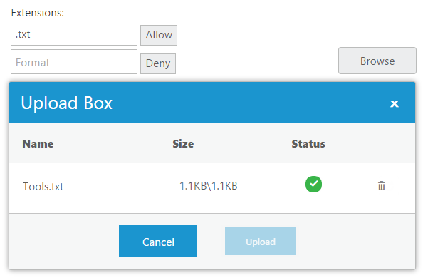
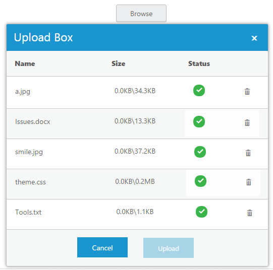

# Getting Started

This section explains briefly about how to create an **Uploadbox** in your application with **Aurelia.** **Essential JavaScript Uploadbox** widget provides support to upload files or photos within your web page. From the following guidelines, you can learn how to upload the files that are used in a Resume Upload scenario. This helps you to restrict some file extensions when you upload the resume in server by using **Uploadbox** control.

The following screenshot demonstrates the functionality of **Uploadbox** with the file extension.

 

In the above screenshot, you can upload a resume that allows **.txt** files. This helps you to avoid unsupported resume formats getting uploaded in a server.

N> To get upload the file, you should either run this sample in Visual Studio IDE or host in local IIS.

## Create Uploadbox in Aurelia

Before we start with Uploadbox, please refer [this page](https://help.syncfusion.com/aurelia/overview#getting-started) page for general information regarding integrating Syncfusion widget’s.

For quick start, we already configured a template project in GitHub repository [syncfusion-template-repository](https://github.com/aurelia-ui-toolkits/syncfusion-template-repository). Run the below set of commands to clone the repository and install the required packages for Syncfusion Aurelia application.



    > git clone "https://github.com/aurelia-ui-toolkits/syncfusion-template-repository"
    > cd syncfusion-template-repository
    > npm install
    > jspm install



The below steps describes to create Syncfusion Aurelia Uploadbox component.

    Create Uploadbox folder inside src/samples/ location.
    Create Uploadbox.html file inside src/samples/Uploadbox folder and use the below code example to render the Uploadbox component. Add an element to render a **Uploadbox.**



    <template>
    

        
Select a file to upload 

        

            <ej-uploadbox id="UploadDefault" e-save-url.bind="save" e-remove-url.bind="remove">
            </ej-uploadbox>
        

    

    </template>



Add the given styles to display the **Uploadbox** with margin alignments.



    



Create a new handler file (.ashx) and save it as **saveFiles.ashx** and then copy the following code into it.



SaveFiles.ashx

    public void ProcessRequest(HttpContext context)
    {
        string targetFolder = HttpContext.Current.Server.MapPath("uploadfiles");
        if (!Directory.Exists(targetFolder))
        {
            Directory.CreateDirectory(targetFolder);
        }
        HttpRequest request = context.Request;
        HttpFileCollection uploadedFiles = context.Request.Files;
        if (uploadedFiles != null && uploadedFiles.Count > 0)
        {
            for (int i = 0; i < uploadedFiles.Count; i++)
            {
                if (uploadedFiles[i].FileName != null && uploadedFiles[i].FileName != "")
                {
                    string fileName = uploadedFiles[i].FileName;
                    int indx = fileName.LastIndexOf("\\");
                    if (indx > -1)
                    {
                        fileName = fileName.Substring(indx + 1);
                    }
                    uploadedFiles[i].SaveAs(targetFolder + "\\" + fileName);
                }
            }
        }
    }



Create a new handler file (.ashx) and save it as **removeFiles.ashx** and then copy the following code into it.



removeFiles.ashx

    public void ProcessRequest(HttpContext context)
    {
        System.Collections.Specialized.NameValueCollection s = context.Request.Params;
        string fileName = s["fileNames"];
        string targetFolder = HttpContext.Current.Server.MapPath("uploadfiles");
        if (Directory.Exists(targetFolder))
        {
            string physicalPath = targetFolder + "\\" + fileName;
            if (System.IO.File.Exists(physicalPath))
            {
                System.IO.File.Delete(physicalPath);
            }
        }
    }



Add the following code example to assign saveUrl and removeUrl for Uploadbox



      export class DefaultFunctionalities {
        constructor() {
           this.save = '../saveFiles.ashx';
           this.remove = '../removeFiles.ashx';
      }
     }



The following screenshot displays an **Uploadbox** control.

 

After you upload the files, the following screen shot is displayed. 

 

N> The above screenshot displays the Uploadbox control that shows the files are uploaded successfully.

## Set Restriction for File Extension

In a real-time scenario, some file extensions are restricted. You can allow files and restrict files by using the following two properties **extensionsAllow** and **extensionsDeny** enabled in **Uploadbox**. 

N> The SaveUrl and RemoveUrl are the same as above (see step 4)

Add input elements to create elements for file extension.

N> Add the following input elements and two button elements to give file extensions that should support uploading. 



     <template>
     

        <table id="uploadTable">
            <tr>
                <td>
                    Extensions:
                </td>
                <td></td>
            </tr>
            <tr>
                <td>
                    <input type="text" id="fileallow" class="tb6 ejinputtext" placeholder="Format" />
                    <input type="button" class="e-btn" id="upbutton1" value="Allow" ej-button="" e-on-click.trigger="allowFileType($event)" />
                </td>
                <td></td>
            </tr>
            <tr>
                <td>
                    <input type="text" id="filedeny" class="tb6 ejinputtext" placeholder="Format" />
                    <input type="button" class="e-btn" id="upbutton2" value="Deny" ej-button="" e-on-click.trigger="denyFileType($event)" />
                </td>
                <td>
                    <ej-uploadbox id="UploadInput" e-save-url.bind="save" e-remove-url.bind="remove" e-multiple-files-selection.bind="multipleFiles"
                                  e-on-create.trigger="create()">
                    </ej-uploadbox>
                </td>
            </tr>
        </table>
      

	</template>



 Add the following code example for click event
 
 

     export class DefaultFunctionalities {
        constructor() {
           this.save = '../saveFiles.ashx';
           this.remove = '../removeFiles.ashx';
      }
	   create() {
         this.uploadobject = $('#UploadInput').data('ejUploadbox');
       }
      allowFileType(event) {
           this.uploadobject.option('extensionsAllow', $('#fileallow').val());
           this.uploadobject.option('extensionsDeny', '');
           $('#filedeny').val('');
         }

      denyFileType(event) {
          this.uploadobject.option('extensionsAllow', '');
          this.uploadobject.option('extensionsDeny', $('#filedeny').val());
          $('#fileallow').val('');
            }
     }


Add the given styles to display the **Uploadbox** with margin alignments.



     



N> You can restrict one or more files at a time by giving it as .html,.txt

The following screenshot displays an **Uploadbox** control with the file extension.

 

The above screenshot shows the **Uploadbox** that allows “**.txt**" file formats. You can give  number of  file formats in both allow and deny textbox elements.

## Upload Multiple Files

You can click the **Browse** button and select files to upload multiple files in **Uploadbox** control. You can see the selected files in **Uploadbox** control and you can upload all the files.

The following screenshot displays an **Uploadbox** control with multiple files.

 

